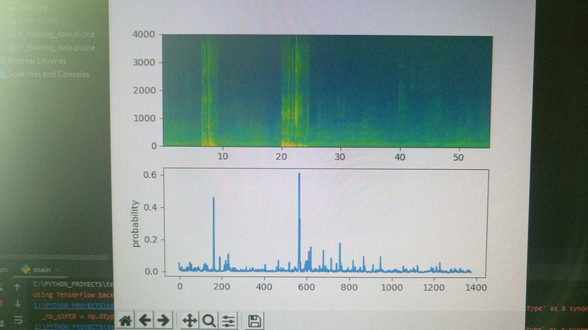
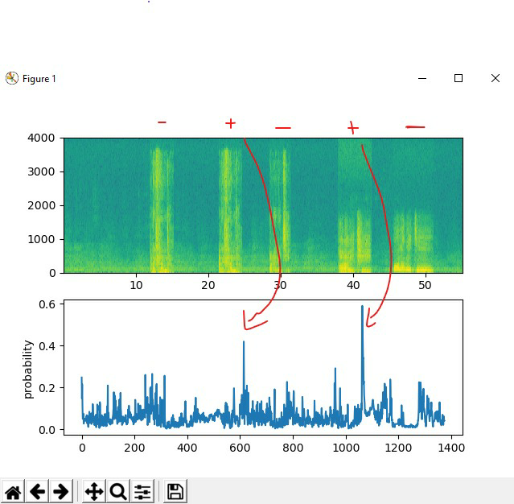

# Hotword_Detection

This is a failed attempt to create a lightweight and opensource Hotword Detection model using LSTM.

The results that we can see were promising, as we can see in the images, the positive word(+) was detected and all the other ones, negatives(-) don't get a high result.
But in practice, it was not accurate enough.

In the future I´ll probably try to make it work correctly.
